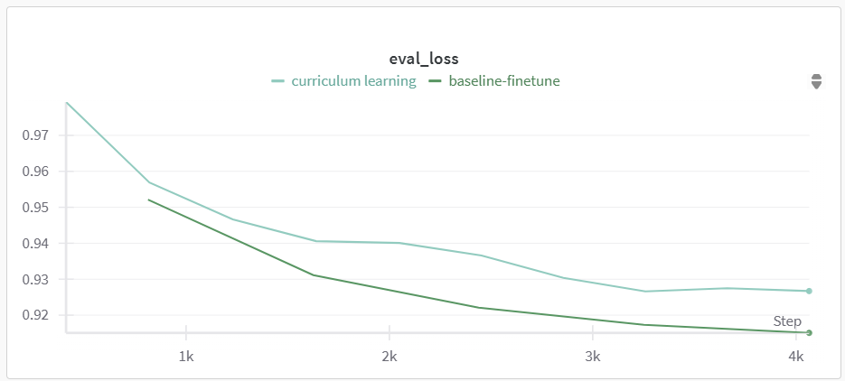
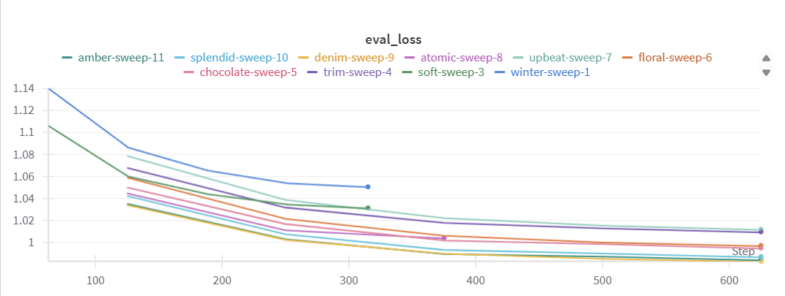
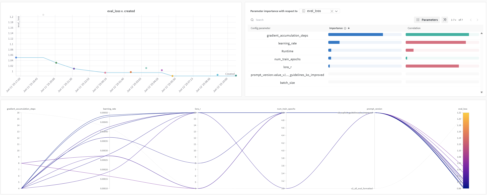
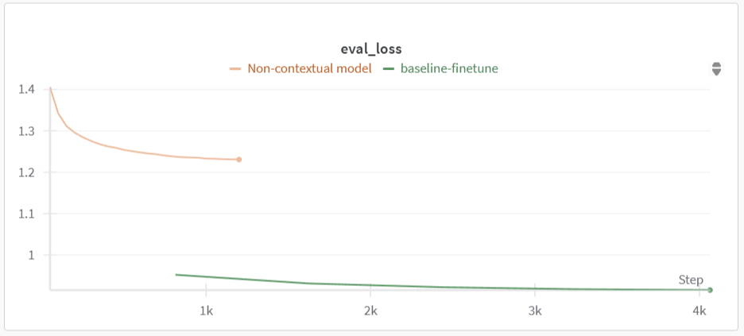

# DPO-UA Framework


## 🚀 How to Run

### 1. Run a Single Training Experiment

Use `multi_prompt_train.py` to run a single training job with your desired hyperparameters:

```bash
python model/multi_prompt_train.py \
  --prompt_version v2_explicit_guidelines_ko_improved \
  --learning_rate 0.0004869 \
  --num_train_epochs 5 \
  --batch_size 2 \
  --gradient_accumulation_steps 4 \
  --lora_r 16
```

#### Available Arguments

| Argument                     | Description                                               | Example Values                        |
|-----------------------------|-----------------------------------------------------------|---------------------------------------|
| `--prompt_version`          | Prompt template version to use                            | `v2_minimal`, `v2_all_eval`, etc.     |
| `--learning_rate`           | Learning rate for training                                | `1e-5`, `5e-5`, `1e-4`, etc.          |
| `--num_train_epochs`        | Number of training epochs                                 | `3`, `5`, etc.                        |
| `--batch_size`              | Batch size per GPU                                        | `2`                                   |
| `--gradient_accumulation_steps` | Number of steps for gradient accumulation             | `4`, `8`, `16`                        |
| `--lora_r`                  | Rank parameter for LoRA fine-tuning                       | `4`, `8`, `16`                        |

### 2. Run a Sweep with W&B

#### Setup

- Make sure you have a [Weights & Biases](https://wandb.ai/) account.
- Login via CLI:

```bash
wandb login
```

#### Sweep Configuration (`model/sweep.yaml`)

Example using Bayesian optimization:

```yaml
method: bayes
metric:
  name: eval_loss
  goal: minimize

parameters:
  prompt_version:
    values: ["v2_all_eval_formatted", "v2_minimal", "v2_explicit_guidelines_ko_improved"]
  learning_rate:
    min: 0.00001
    max: 0.0005
  num_train_epochs:
    values: [3, 5]
  batch_size:
    value: 2
  gradient_accumulation_steps:
    values: [4, 8, 16]
  lora_r:
    values: [4, 8, 16]
```

#### Launch the Sweep

Instead of using the default `wandb agent`, launch the sweep using your own script:

```bash
python model/sweep_runner.py
```

The `sweep_runner.py` script internally registers the sweep and uses `wandb.agent` to execute training using configurations defined in `sweep.yaml`.

## Experimental Results

#### Zero-shot vs. Few-shot Prompting
Below are example feedback excerpts generated from different prompting configurations. These are shortened samples of actual self-introduction evaluations.

##### Reference
> 자기소개서는 구조가 잘 잡혀 있고, 논리적으로 작성되었습니다. 지원자는 본인의 경력과…

##### Zero-shot
> 하늘빛님의 자기소개서는 기술적 역량과 열정, 그리고 사용자 중심의 접근법을 잘 보여주는 훌륭한 예시입니다. 다음은 피드백과 개선 제안입니다:
>
> **긍정적인 점:**  
> **기술적 역량 강조**: …

##### One-shot
> 하늘빛의 자기소개서는 전반적으로 명확하고 구체적인 경험과 기술적 역량을 잘 보여주고 있어 긍정적인 인상을 줍니다. 각 항목별로 몇 가지 개선 사항과 추가적인 피드백을 제안해 드리겠습니다:
>
> **#1) 마음을 담은 자기소개: 더 나은 사용자 경험을 위해**  
> **긍정적인 점:** …

##### Two-shot
> 하늘빛 지원자의 자기소개서는 전반적으로 명확하고 구체적인 경험과 기술적 역량을 잘 보여주고 있습니다. 각 섹션에서 다음과 같은 개선 사항을 제안드립니다:
>
> **1) 자기소개**  
> - **개선 사항**: 자기소개 부분에서…

#### Baseline Fine-Tuning + Curriculum Learning  
  
| Configuration                     | Resume KoSimCSE Score | Self-Intro KoSimCSE Score |  
|----------------------------------|----------------------|--------------------------|  
| Baseline Fine-Tuning             | 0.8482               | 0.8501                   |  
| Baseline Fine-Tuning + Curriculum Learning | 0.8491     | 0.8276                   |

#### Sweep Results & Hyperparameter Settings
The key hyperparameters selected based on the Weights & Biases sweep results are as follows:

| Parameter                   | Value                          |
|----------------------------|-------------------------------|
| batch_size                 | 2                             |
| gradient_accumulation_steps | 4                             |
| learning_rate              | 4.869e-4                      |
| lora_r                    | 16                            |
| num_train_epochs          | 5                             |
| prompt_version            | "v2_explicit_guidelines_ko_improved" |

For detailed sweep results, please visit the [W&B project dashboard](https://wandb.ai/codream00-sungkyunkwan-university/resume_eval_ko_sweep_v4/sweeps/mszinhca?nw=nwusercodream00).





#### User Context Injection via Pseudo-label

| Configuration (Training Strategy)              | Resume Similarity | Self-Intro Similarity |
|-----------------------------------------------|-------------------|------------------------|
| Basic                  | 0.7899            | 0.8080                 |
| Trained with Pseudo-label     | 0.8482            | 0.8501                 |

| Configuration (Training + Inference)       | Resume Similarity | Self-Intro Similarity |
|--------------------------------------------|-------------------|------------------------|
| Trained with Pseudo-label – Inference: Off   | 0.8260        | 0.8302             |
| Trained with Pseudo-label – Inference: On    | 0.8482            | 0.8501                 |

##### Pseudo-label KoSIMCSE
| User Context                               | Not Included      | Included |
|--------------------------------------------|-------------------|------------------------|
| Keyword Label   | 0.8136            | 0.8255             |
| Job Label       | 0.8186            | 0.8203                 |
| Resume Label    | 0.8214            | 0.8372                 |

**Note on Evaluation Metrics**  
- **Keyword Label** score is based on the **Self-Introduction Similarity**.  
- **Job Label** score is calculated as the **average of Resume Similarity and Self-Introduction Similarity**.  
- **Resume Label** score is based solely on **Resume Similarity**.

##### Reference
> 정개발의 이력서는 포지션에 요구하는 기술과 경험이 잘 부합하며, 특히 C# 및 .NET Core를 활용한 경험과 SQL Server에 대한 기본적 이해가 강조되어 있습니다. 게임 개발 동아리에서의 팀 프로젝트 참여는 경험을 더해주며, RabbitMQ 및 Azure App Service와 같은 관련 툴에 대한 경험도 긍정적인 요소입니다. 자격요건을 충족하고, 우대사항에서도 RabbitMQ 사용 경험이 있어 높은 점수를 부여합니다.

##### Trained with Pseudo-label - User Context Not Included
> 정개발의 이력서는 신입 개발자로서의 기본적인 자격요건을 충족하고 있으며, 관련 프로젝트 경험이 있어 긍정적입니다. 그러나, 경력이 부족하고, 기술적 깊이가 부족한 점이 아쉽습니다. 특히, 지원하는 포지션에 대한 구체적인 경험이 부족하여 감점이 있었습니다.

##### Trained with Pseudo-label - User Context included
> 정개발 지원자의 이력서는 포지션에 적합한 기술과 경험을 잘 보여주고 있습니다. C# 및.NET Core, SQL Server, RabbitMQ, Azure App Service 등 요구되는 기술 스택을 모두 갖추고 있으며, 게임 개발 동아리에서의 경험은 특히 긍정적입니다. 그러나, 경력이 신입 수준으로 제한적이며, 우대사항 중 RabbitMQ 사용 경험이 기본적인 수준에 그치고 있어 감점이 있었습니다. 전반적으로 이력서는 매우 우수하며, 포지션에 적합한 인재로 평가됩니다.

### Prompt Learning
#### Hard Prompt
##### Hard Prompt A
```json
[
  {"role": "system", "content": "You are an assistant that evaluates resume documents."},
  {"role": "user", "content": "[Job-Post]\n...\n[Resume]\n...\n[Keywords]\n...\n[Self-Introduction]\n..."},
  {"role": "assistant", "content": "[eval_resume]: ...\n[eval_selfintro]: ...\n[summary]: ..."}
]
```
- Provides basic system role and separates sections with labels. Output is structured with labels, but no explicit evaluation guidelines are given.

##### Hard Prompt B
```json
[
  {"role": "system", "content": "Evaluate resumes."},
  {"role": "user", "content": "Job: ...\nResume: ...\nKeywords: ...\nSelf-Introduction: ..."},
  {"role": "assistant", "content": "...eval_resume text...\n...eval_selfintro text...\n...summary text..."}
]
```
- A minimal and concise format suitable for fast testing. It lacks output labels and guidance, which may reduce consistency.

##### Hard Prompt C
```json
[
  {"role": "system", "content": "당신은 숙련된 인사(HR) 어시스턴트입니다. ... (평가 지침 포함)"},
  {"role": "user", "content": "[직무 공고] ...\n[이력서] ...\n[키워드] ...\n[자기소개서] ...\n**평가 지침** ..."},
  {"role": "assistant", "content": "[summary]: ...\n[eval_resume]: ...\n[eval_selfintro]: ..."}
]
```
- Includes explicit evaluation guidelines in Korean, making it the most structured and informative prompt. Helps maintain consistent quality and format across outputs.

##### Prompt KoSimCSE results
| Prompts              | Resume Similarity | Self-Intro Similarity |
|-----------------------------------------------|-------------------|------------------------|
| Hard Prompt A       | 0.8281            | 0.8237                 |
| Hard Prompt B       | 0.8174            | 0.8259                 |
| Hard Prompt C       | 0.8330            | 0.8359                 |
| Soft Prompt         | 0.8682            | 0.8598                 |

### Experimental Results: KoSimCSE Similarity by Training Strategy

| Configuration (Training Strategy)              | Resume Similarity | Self-Intro Similarity |
|-----------------------------------------------|-------------------|------------------------|
| Trained with Basic Prompt                  | 0.7899            | 0.8080                 |
| Trained with Explicit Guideline Prompt     | 0.8482            | 0.8501                 |
| Trained with Explicit Guideline + Curriculum | 0.8491            | 0.8276                 |
| + Soft Prompt | 0.8682             | 0.8598                 |

> All models share the same base (EXAONE-3.5), and the similarity scores represent average values measured by KoSimCSE.

